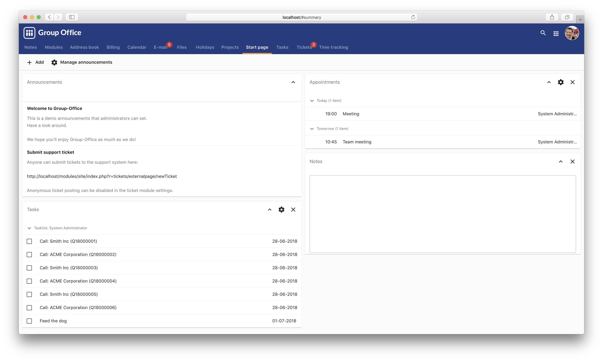

Group-Office manual
===================

Group-Office is an open-source groupware and CRM application. Visit https://www.group-office.com for more information.

   
   The Group Office start page

.. toctree::
   :maxdepth: 2
   :caption: Administration

   install/install
   upgrade/upgrade
   backup
   migrate
   system-settings/index

.. toctree::
   :maxdepth: 2
   :caption: Using Group-Office

   using/my-account
   using/connect-a-device/connect-a-device
   using/links
   using/comments
   using/sharing
   using/email
   using/calendar
   using/tickets
   using/projects
   using/holidays
   
.. toctree::
   :maxdepth: 2
   :caption: Contribute

   translations
   developers