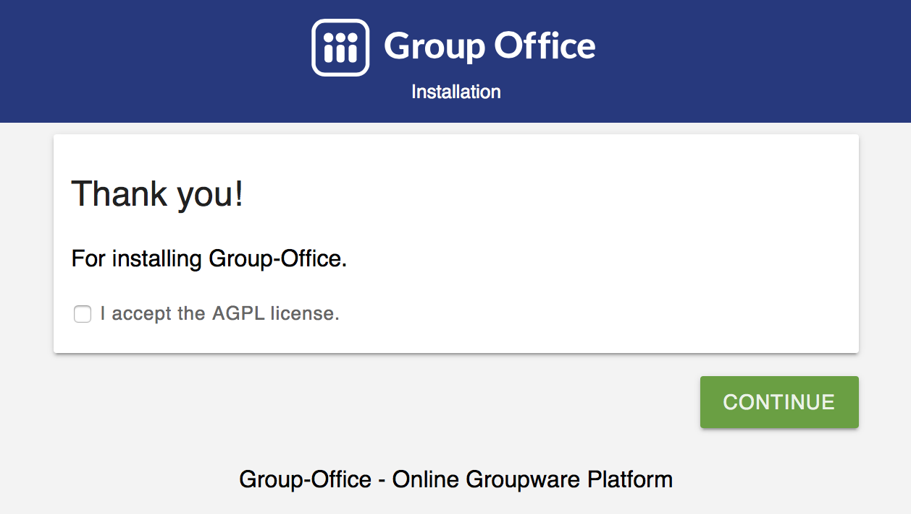

Installation
============

We recommend installing using the Debian packages or Docker. These methods will
install all dependencies automatically and will be the easiest for you.

Debian / Ubuntu package
--------------

Our preferred way of installing is using our debian packages:
 
First add our repository to /etc/apt/sources.list. If you run PHP 7.0 (Debian 9) add:

.. code:: bash

   deb http://repo.group-office.com/ 63-php-70 main

If you run PHP 7.1 or greater (Ubuntu 18.04+) add:

.. code:: bash

   deb http://repo.group-office.com/ 63-php-71 main

Add our public key:

.. code:: bash
   gpg --keyserver pool.sks-keyservers.net --recv-keys 0758838B
   gpg --export --armor 0758838B | sudo apt-key add -

Then install Group-Office by running:

.. code:: bash

   apt-get install groupoffice

Then visit http://yourserver/groupoffice and the installer should appear:

   The Group-Office installer

Follow the instructions on screen and enjoy Group-Office!

Docker
------

It's very easy to install Group-Office with docker. Please follow the instructions
on our docker-groupoffice github repository:

https://github.com/Intermesh/docker-groupoffice

If you'd like to setup a developer environment then you should use:

https://github.com/Intermesh/docker-groupoffice-development

Manually with the Tarball download
----------------------------------

We strongly recommend that you use our Debian packages or Docker over this method.
But if you really want to use the Tarball source then here is how.

System requirements
^^^^^^^^^^^^^^^^^^^

You need a Linux server with:

.. table:: Software
   :widths: auto

   ====================  ===========
   Type                  Requirement
   ====================  ===========
   Operating System      Linux / Docker
   Webserver             Apache 2+
   Database              MySQL 5.3+
   Programming language	 PHP 7.0+
   ====================  ===========

Required PHP Extensions
+++++++++++++++++++++++

- pcre       
- mbstring
- ctype
- date
- iconv
- curl
- zip
- soap
- gd
- pdo
- pdo_mysql
- calendar

Grab the source from:

https://sourceforge.net/projects/group-office/files/6.3/

Put the unpacked source in apache's document root and open it in the web browser.
Then follow the installer's instructions.