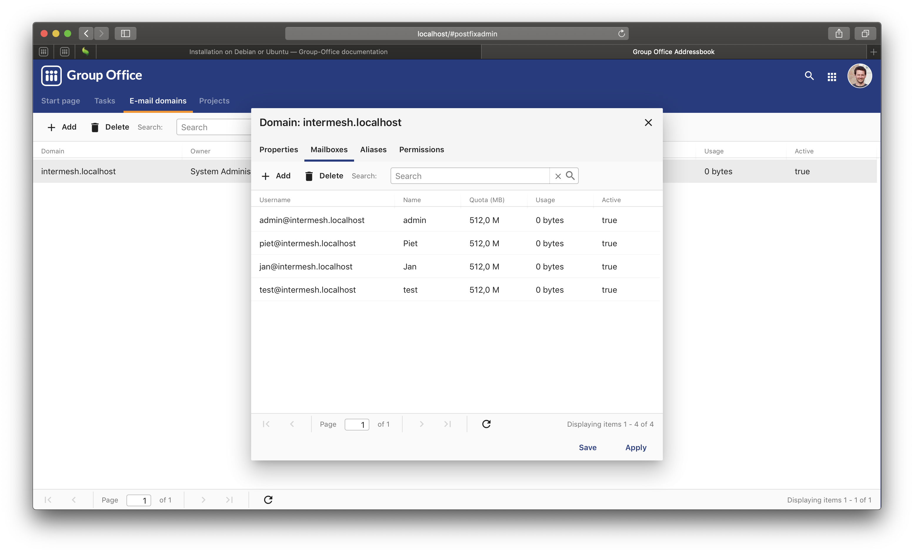

.. _install-debian:

Installation on Debian or Ubuntu
================================

Core system
-----------

Our preferred way of installing is using our Debian packages:

1. On Debian login as the root server and on Ubuntu become root by running::

      sudo -s
      
2. Only on Ubuntu make sure the "universe" repository is enabled::

      sudo add-apt-repository universe

3. First add our repository to the package management system. 

   If you run PHP 7.0 (Debian 9) run::
   
      echo "deb http://repo.group-office.com/ 63-php-70 main" > /etc/apt/sources.list.d/groupoffice.list

   If you run PHP 7.1 or greater (Ubuntu 18.04+) add::

      echo "deb http://repo.group-office.com/ 63-php-71 main" > /etc/apt/sources.list.d/groupoffice.list
      
4. Make sure "dirmngr" is installed for adding the public key::

      apt-get install dirmngr

5. Add our public key::

      apt-key adv --recv-keys --keyserver pool.sks-keyservers.net 0758838B
      
6. Update APT::

      apt-get update

7. Then install Group-Office by running::

      apt-get install groupoffice

8. If you purchased Group-Office Professional licenses then make sure the 
   `Ioncube loader <http://www.ioncube.com/loaders.php>`_ is installed and place the license 
   files in "/usr/share/groupoffice/". For example 
   "/usr/share/groupoffice/groupoffice-pro-6.3-license.txt".

9. Then visit http://yourserver/groupoffice and the installer should appear:

   .. figure:: _static/installer.png
      :alt: The Group-Office installer

      The Group-Office installer     

10. Follow the instructions on screen and enjoy Group-Office!


Mailserver
----------

You can also use Group-Office as a complete e-mail platform. It's based on:

1. `Postfix <http://www.postfix.org>`_
2. `Dovecot <https://www.dovecot.org>`_
3. Group-Office module to manage mailboxes in the database

At the moment this is only possible with the Debian / Ubuntu packages.

When Group-Office is already installed you can run::

   apt-get install groupoffice-mailserver

When this command is finished login to Group-Office as admin and install the 
"E-mail domains" module. In this module you can manage the domains, mailboxes
and aliases.



   Manage e-mail domains in Group-Office

TLS / SSL
`````````

It's required to install SSL certificates for your mailserver to operate 
properly. So obtain an SSL certificate and take these steps:

1. Configure Dovecot IMAP in file */etc/dovecot/conf.d/10-ssl.conf*::

      ssl = yes
      ssl_cert = </etc/ssl/group-office.com/certificate.crt
      ssl_key = </etc/ssl/group-office.com/certificate.key
      ssl_ca = </etc/ssl/group-office.com/cabundle.crt

2. Restart dovecot::

      invoke-rc.d dovecot restart

3. Configure Postfix SMTP with these commands::

      postconf -e 'smtpd_tls_cert_file = /etc/ssl/group-office.com/certificate.crt'
      postconf -e 'smtpd_tls_key_file = /etc/ssl/group-office.com/certificate.key'
      postconf -e 'smtpd_tls_CAfile = /etc/ssl/group-office.com/cabundle.crt'

4. Restart postfix::

      invoke-rc.d postfix restart

Anti spam / virus
`````````````````

The package above installs the bare minimum so you can be free to configure your
system in your own way. But for your convenience we've also prepared an anti 
spam and anti virus solution based on:

1. `rspamd <https://www.rspamd.com>`_
2. `clamav <http://www.clamav.net>`_

To install take these steps:

1. Add the rspamd repository because the official Debian repositories contain
   outdated versions::

      apt-get install -y lsb-release wget # optional
      CODENAME=`lsb_release -c -s`
      wget -O- https://rspamd.com/apt-stable/gpg.key | apt-key add -
      echo "deb [arch=amd64] http://rspamd.com/apt-stable/ $CODENAME main" > /etc/apt/sources.list.d/rspamd.list
      echo "deb-src [arch=amd64] http://rspamd.com/apt-stable/ $CODENAME main" >> /etc/apt/sources.list.d/rspamd.list        

2. Update APT::

      apt-get update
  
3. Install groupoffice-mailserver-antispam::

      apt-get install groupoffice-mailserver-antispam

4. Run the rspamd config wizard::

      rspamadm configwizard

5. Test if the spam filter works by sending a `GTUBE <https://en.wikipedia.org/wiki/GTUBE>`_ message

6. Test if the anti virus works by sending an `EICAR test file <https://en.wikipedia.org/wiki/EICAR_test_file>`_

7. Checkout the rspamd Web GUI at http://yourserver/rspamd/


Multi Instance
--------------

It's possible to host multiple instances of Group Office on one server. After
installing Group Office via the Debian packages or Docker you do the following
to enable it:

1. Make sure the main install database user has permissions to create databases
   by running the following SQL:
   
   .. code:: sql

      GRANT ALL PRIVILEGES ON *.* TO 'groupoffice'@'%' REQUIRE NONE WITH GRANT OPTION MAX_QUERIES_PER_HOUR 0 MAX_CONNECTIONS_PER_HOUR 0 MAX_UPDATES_PER_HOUR 0 MAX_USER_CONNECTIONS 0;
   
2. Create "multi_instance" config folder::

      mkdir /etc/groupoffice/multi_instance && chown www-data:www-data /etc/groupoffice/multi_instance
	 

3. Create "multi_instance" data folder::
   
      mkdir /var/lib/groupoffice/multi_instance && chown www-data:www-data /var/lib/groupoffice/multi_instance
   
4. Login as administrator into the main Group Office instance that will manage the
   other instances and install the "Multi Instance" module from the "Community" package.

