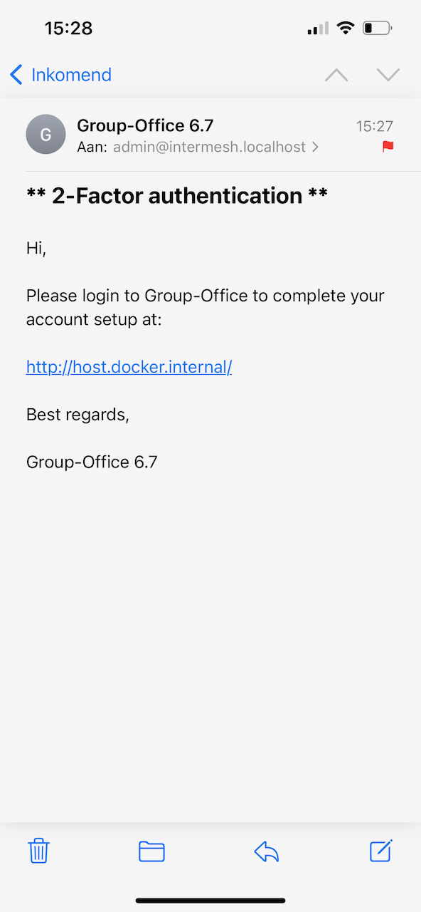
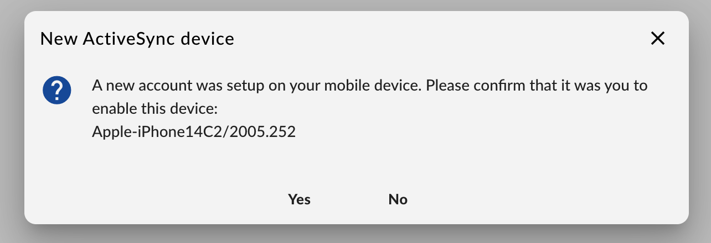
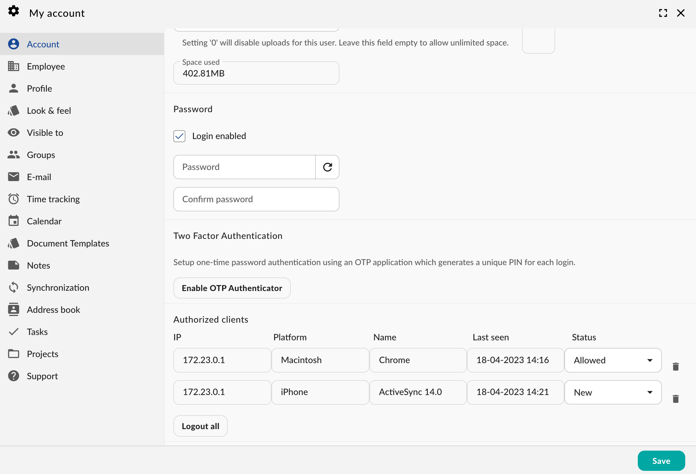
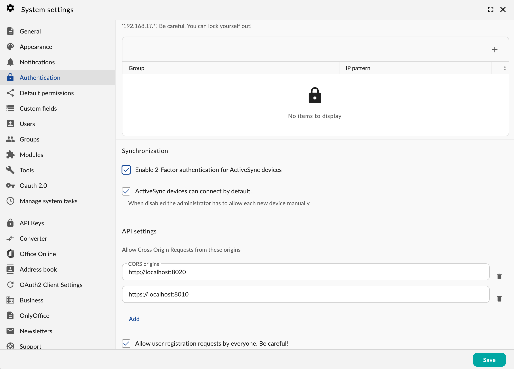

2-Factor authentication for Exchange ActiveSync
===============================================

Since version 6.7 we've built in a special two factor authentication mechanism for ActiveSync devices. Unfortunately
the protocol doesn't support native 2-factor authentication but we found a clever workaround.
When enabled, the user can setup an account with his username and password. But it will only synchronise an informative
message:

	 2-Factor authentication message

It informs you that the account setup must be completed by logging in to Group-Office to
allow the device to connect:

	 2-Factor authentication approve device

The connected devices can be managed from :ref:`my-account` ->

	 Connected clients

Enabling 2-Factor authentication for Exchange ActiveSync
--------------------------------------------------------

To enable 2-Factor authentication for Exchange ActiveSync go to
System Settings -> Authentication and check 'Enable 2-Factor authentication for ActiveSync devices'.

	 Synchronization system settings