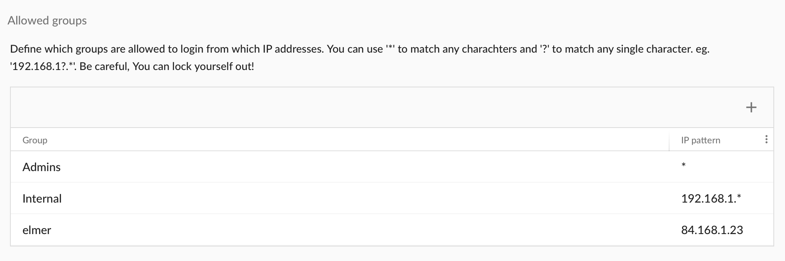

.. auth-allow-groups:

Allowed groups
==============

To enhance security you can limit the locations (IP Addresses) where users can login to the system.
You can set this per group:

	 Allowed groups

.. warning::

   You can easily lock everybody out from the system with this feature. I recommend that you add group "Admins" with
   pattern "*" first so that Admins can always login. When you're sure everything is setup correctly you can remove
   that rule.

Rules
-----

Each rule has a group and a pattern for IP addresses. You can use "*" to match any part of an IP address and '?' to
match a single character.

Some examples:

- "*" will match any IP address
- "192.168.1.?" will match 192.168.1.1 till 192.168.1.9.
- "192.168.1.* will match 192.168.1 till 192.168.1.255

If any of the rules matches for a user login is allowed.