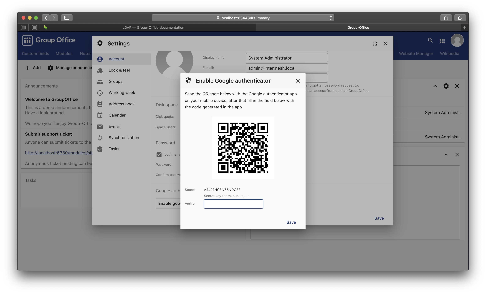
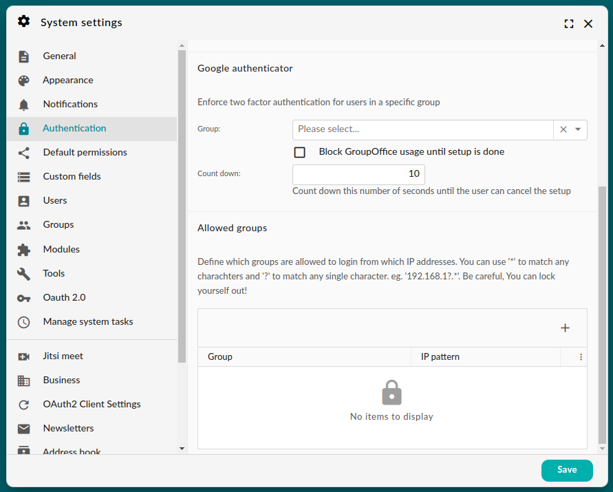

.. _google-authenticator:

Google Authenticator
====================

You can use two factor authentication when the Google Authenticator module has 
been installed. 

First install any OTP app on your mobile phone. You can use for example:

1. `Google Authenticator <https://play.google.com/store/apps/details?id=com.google.android.apps.authenticator2&hl=nl>`_
2. `OTP Auth <https://itunes.apple.com/us/app/otp-auth/id659877384>`_ (iOS only)

After installing an OTP app on your phone go to "My Account" -> "Account" and 
click on the "Enable Google Authenticator" button.

	 Google Authenticator

You will be prompted for your Group-Office password. Next you will be asked to 
scan the QR code with your app to register Group-Office. Enter the code from 
the phone to confirm you've set it up and you're done.

.. note:: 

   While this module is called Google authenticator it doesn't need a 
   Google account. It does not interact with Google when logging in in any way.

Enforce 2FA for user groups
---------------------------

System administrators can enforce two factor authentication for specific user groups. In the system settings screen,
open the tab 'Authentication' and select a group.

	Enforcing 2FA in Group Office 6.6

