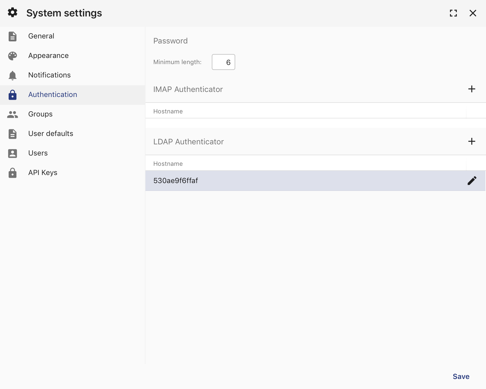
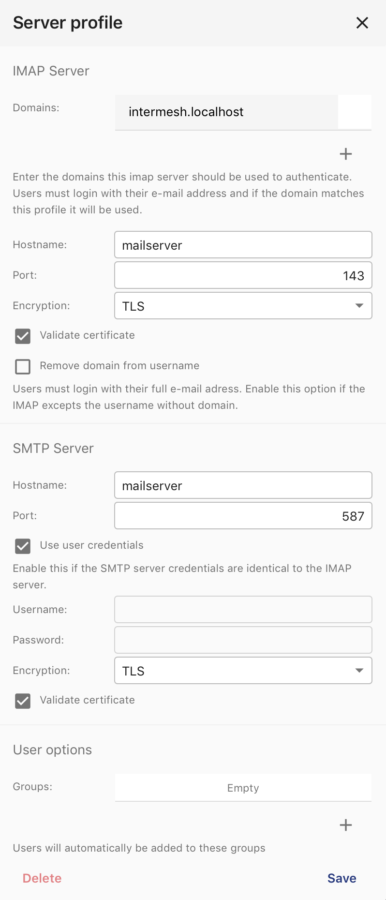

.. _imap-authentication:

IMAP
====

You can use an IMAP server to auto create users and e-mail accounts.

Install
-------

1. Install the *imapauthenticator* module at Start menu -> Modules
2. Reload GroupOffice

Configure
---------

Go to System Settings -> Authentication. There's a new IMAP Autentication section
there.

Click on the add button to add a new IMAP server profile:

Now you should be able to login with the full e-mail address. You can't change
passwords with GroupOffice using this autentication method.