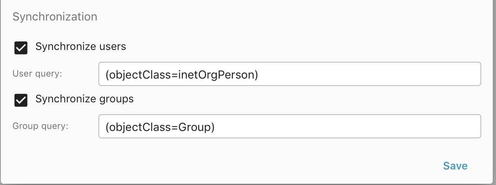

LDAP
====

You can use an LDAP server to authenticate and autocreate Group-Office users and
e-mail accounts. 

Install
-------

1. Install the *ldapauthenticator* module at Start menu -> Modules
2. Reload Group-Office

Configure
---------

Go to System Settings -> Authentication

.. image:: ../../_static/ldap/4-ldap-authentication.png
   :width: 500px
   :alt: LDAP server profile

There's a new section for LDAP server profiles. Click on the add button to add 
a profile.

Server profile
``````````````
Enter the LDAP server details and domains.
The domains are important because users are stored as and need to login with <LDAPUSER>@<DOMAIN>
to trigger the LDAP authenticator.

.. image:: ../../_static/ldap/1-ldap-server-profile.png
   :width: 500px
   :alt: LDAP server profile

**Default domain**

A default domain can be set in the "Authentication" page. When that is set the user can also
login without the domain. Make sure there's no local user with the same username because that will
be preferred over the LDAP user. So if there's a user "admin" on Group-Office and a user "admin" on the
LDAP server. You can't login without the domain.

**Microsoft ActiveDirectory**

If you're using Microsoft ActiveDirectory then you should use "**samaccountname**" as the username attribute.
The users DN is typically **CN=Users,DC=example,DC=com**

Now check if you can login with the LDAP domain:

.. image:: ../../_static/ldap/2-ldap-login.png
   :width: 500px
   :alt: LDAP login

It should autocreate the LDAP user. In the user settings it won't be possible
to change the password as that's not supported yet:

.. image:: ../../_static/ldap/3-ldap-settings.png
   :width: 500px
   :alt: LDAP User settings


User query
----------
The user query can be used to narrow down the users that are allowed to login and / or synchronized.

For example all users except the members of 'ship_crew'::

    (&(objectClass=inetOrgPerson)(!(memberOf=CN=ship_crew,ou=people,dc=planetexpress,dc=com)))

Synchronization
---------------

It's also possible to synchronize users and groups from the LDAP server. Simply enable
the checkboxes and optionally adjust the queries to fetch the correct users and groups.

When you enable the sync, it will schedule the sync to run the next minute. After that 
it will sync daily at midnight.




Mapping
-------

When users are created from LDAP a mapping is made from LDAP attributes to the Group-Office user.
This is the default mapping which also contains some examples::

   $config['ldapMapping'] = [
   				'enabled' => function($record) {
   					//return $record->ou[0] != 'Delivering Crew';
   					return true;
   				},


   				'diskQuota' => function($record) {
   				    // return in bytes
   					//return 1024 * 1024 * 1024;
   					return null;
   				},
   				'email' => 'mail',
   				'recoveryEmail' => 'mail',
   				'displayName' => 'cn',
   				'firstName' => 'givenname',
   				'lastName' => 'sn',
   				'initials' => 'initials',

   				'jobTitle' => 'title',
   				'department' => 'department',
   				'notes' => 'info',

   //				'addressType' => function($record) {
   //					return \go\modules\community\addressbook\model\Address::TYPE_WORK;
   //				},
   				'street' => 'street',
   				'zipCode' => 'postalCode',
   				'city' => 'l',
   				'state' => 's',
   //				'countryCode' => function($record) {
   //					return "NL";
   //				},

   				'homePhone' => 'homePhone',
   				'mobile' => 'mobile',
   				'workFax' => 'facsimiletelephonenumber',
   				'workPhone' => 'telephonenumber',

   				'organization' => 'organizationname',

   //				'homeDir' => function($record) {
   //					//relative path from group-office file_storage_path
   //					return "ldap_homes/" . $record->uid[0];
   //				}
   				];

You can override this default by entering this in your :ref:`config.php <configuration>` file.

.. note:: Mappings are supported since 6.5.47

Advanced
````````
When a user or group is synchronized. It fires an event. So it's possible
to build a module that can customize the LDAP synchronization.

If you want to test the sync on the terminal lookup the ID from your configuration in table 'ldapauth_server' and run::

Test connectivity::

   php cli.php community/ldapauthenticator/Sync/test --id=<ID FROM DATABASE> --debug=1

To sync users::

   php cli.php community/ldapauthenticator/Sync/users --id=<ID FROM DATABASE> --dryRun=1 --delete=1 --maxDeletePercentage=50

And for groups::

   php cli.php community/ldapauthenticator/Sync/groups --id=<ID FROM DATABASE> --dryRun=1 --delete=1 --maxDeletePercentage=50

For debugging you could also add --debug=1 to output some extensive debug information

Test environment
----------------
For testing I've used this docker image: https://hub.docker.com/r/rroemhild/test-openldap/

