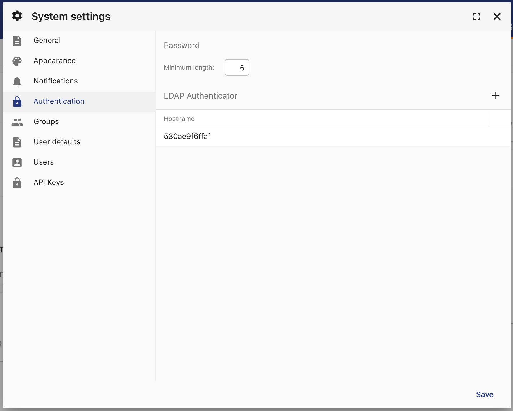
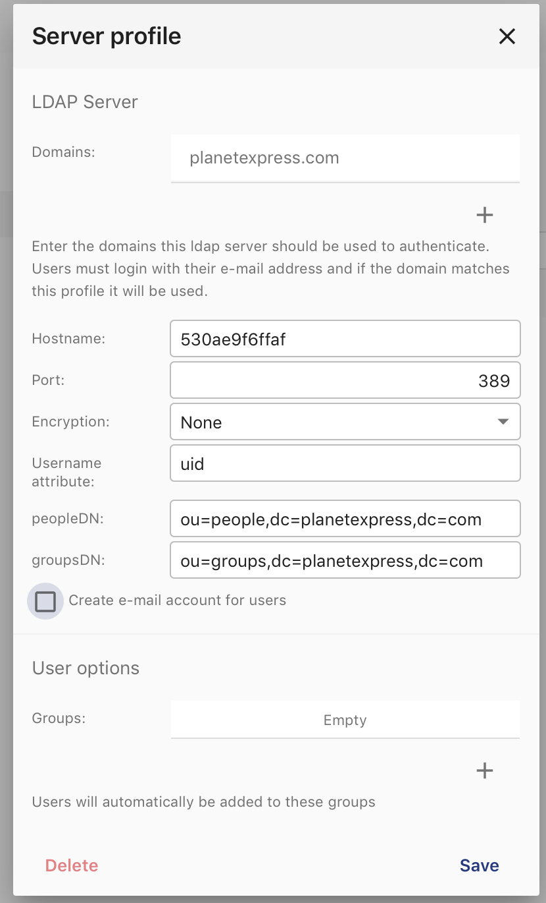
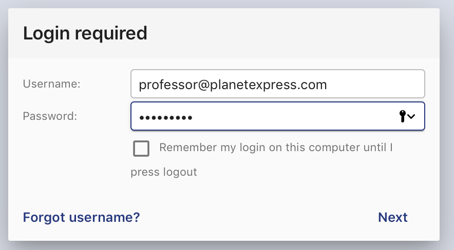
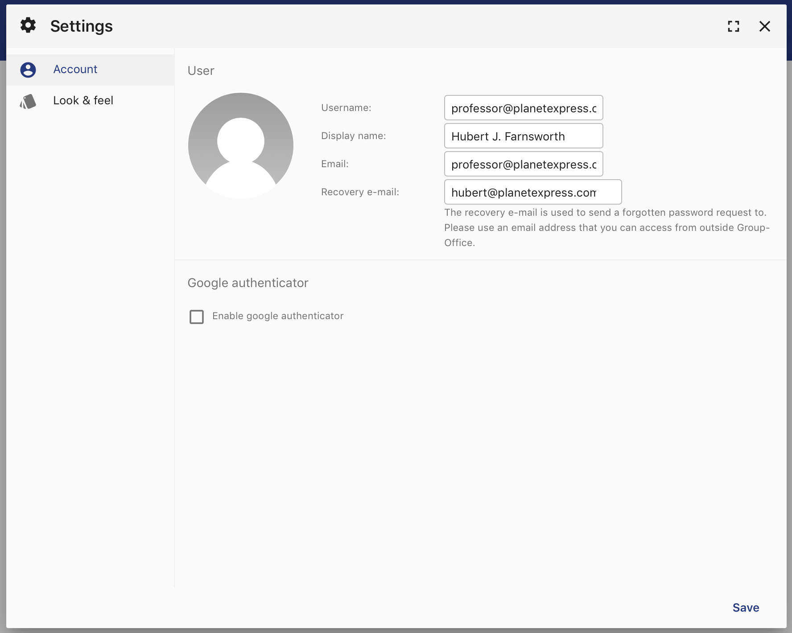

LDAP
====

You can use an LDAP server to authenticate and autocreate Group-Office users and
e-mail accounts. 

Install
-------

1. Install the *ldapauthenticator* module at Start menu -> Modules
2. Reload Group-Office

Configure
---------

Go to System Settings -> Authentication

There's a new section for LDAP server profiles. Click on the add button to add 
a profile. Enter the LDAP server details and domains.
The domains are important because users need to login with <LDAPUSER>@<DOMAIN> 
to trigger the LDAP authenticator.

Now check if you can login with the LDAP domain:

It should autocreate the LDAP user. In the user settings it won't be possible
to change the password as that's not supported yet:

Test environment
----------------
For testing I've used this docker image: https://hub.docker.com/r/rroemhild/test-openldap/

.. code:: bash

   docker pull rroemhild/test-openldap
   docker run --privileged -d -p 389:389 rroemhild/test-openldap
