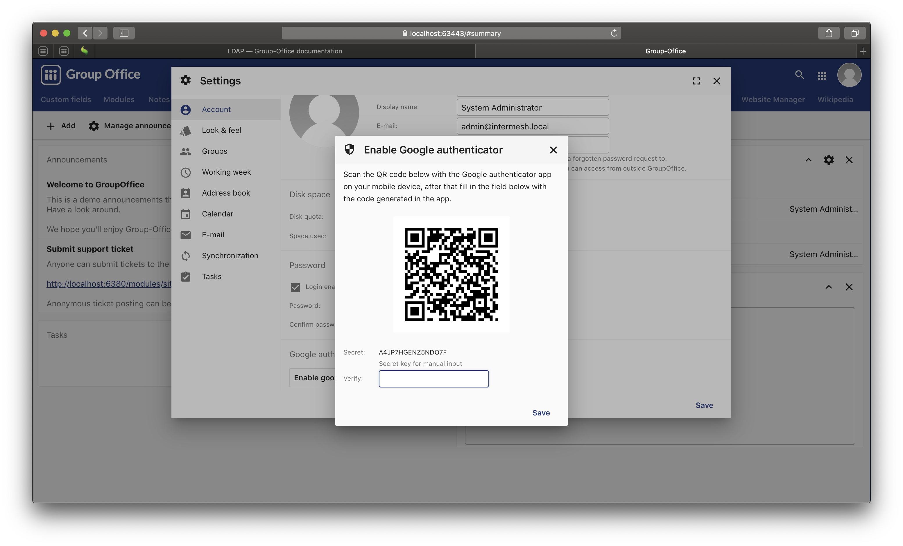
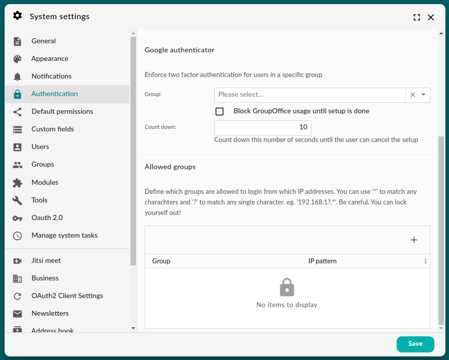

.. _otp:

OTP Client Configuration
========================

You can use two factor authentication (2FA for short) when the OTP Authenticator module has been installed. You can
find it in the Community package.

.. note:: Prior to Group Office 6.7, this module was named Google Authenticator. We renamed it to a more generic name.

First install any OTP app on your mobile phone or desktop. You can use for example:

1. `Google Authenticator <https://play.google.com/store/apps/details?id=com.google.android.apps.authenticator2&hl=nl>`_
2. `OTP Auth <https://itunes.apple.com/us/app/otp-auth/id659877384>`_ (iOS only)
3. `Aegis Authenticator <https://getaegis.app>` is a powerful open source OTP client for Android

After installing an OTP app on your phone go to "My Account" -> "Account" and 
click on the "Enable OTP Authenticator" button.

	 Google Authenticator module in Group-Office 6.6

You will be prompted for your Group-Office password. Next you will be asked to 
scan the QR code with your app to register Group-Office. Enter the code from 
the phone to confirm you've set it up and you're done.

Enforce 2FA for user groups
---------------------------

System administrators can enforce two factor authentication for specific user groups. In the system settings screen,
open the tab 'Authentication' and select a group.

	Enforcing 2FA in Group Office 6.6

